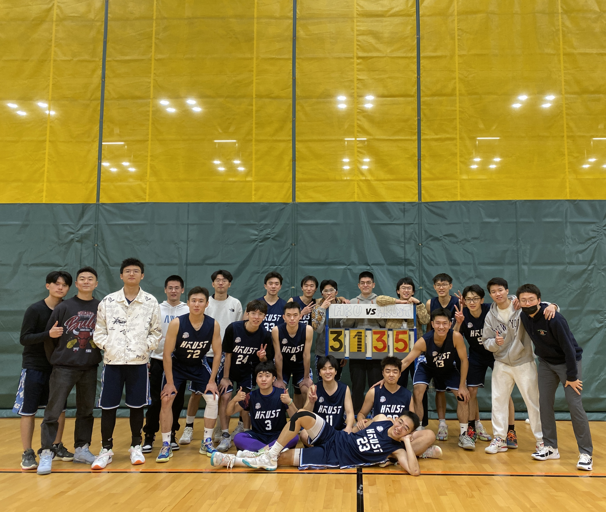

This page is used to keep track of my extracurricular activities, as well as my hobbies.

### Volunteer Experience

- I was one of the peer mentors in the Peer Mentor Program hosted by [**MSSSUG**](https://ug-msss.hkust.edu.hk/) (Mainland Scholar and Students Society Undergraduate), in which I led orientation activities for 1st-year students to get adapted to university life, such as workshops on course registration, major selection, etc. *(Sep. 2020 - Jun. 2022)*

### Sports Team
- I was on the HKUST [**MSSSUG**](https://ug-msss.hkust.edu.hk/) Basketball Team, in which I mainly played the Small Forward (SF) position and wore uniform number 13. Shown below is a picture of our team after the game against HKU in the 2023 tournament.

### Personal Hobbies

- I am a huge coffee lover and I brew my own coffee nearly every day. Most of the time I make espresso-based drinks, such as latte and americano, but I also make cold brew coffee and Vietnamese coffee from time to time.
